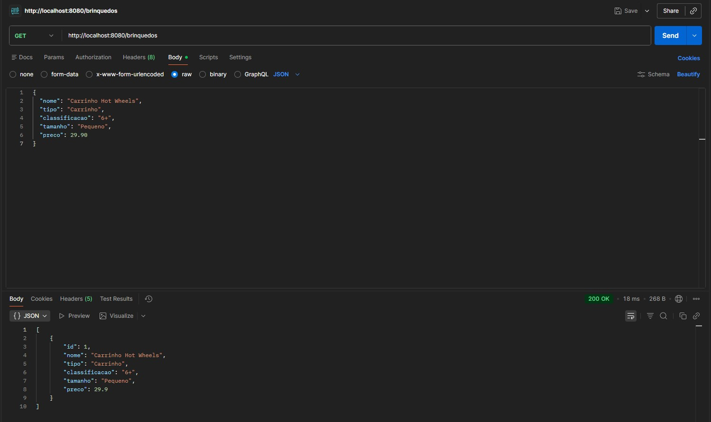
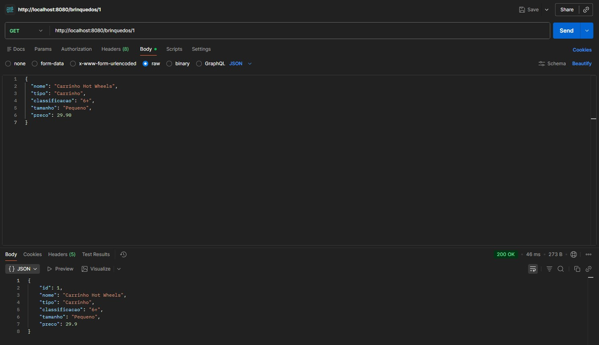
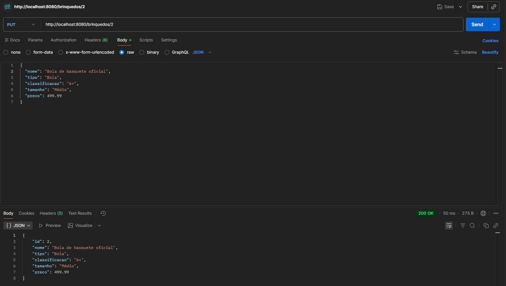
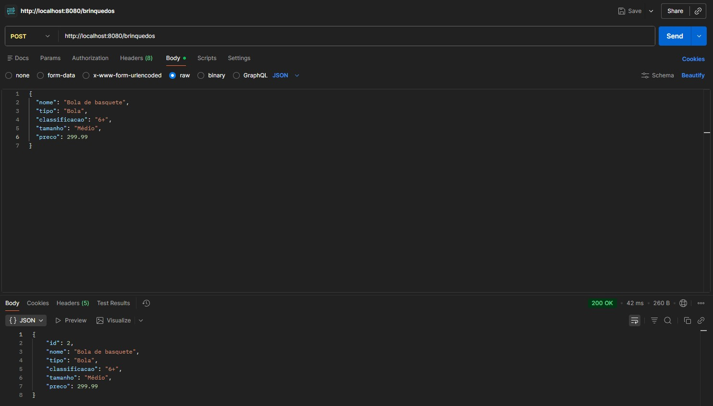
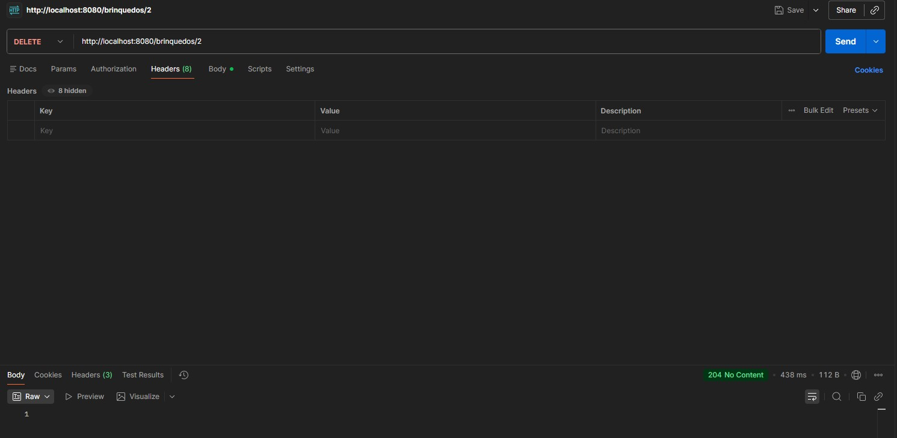
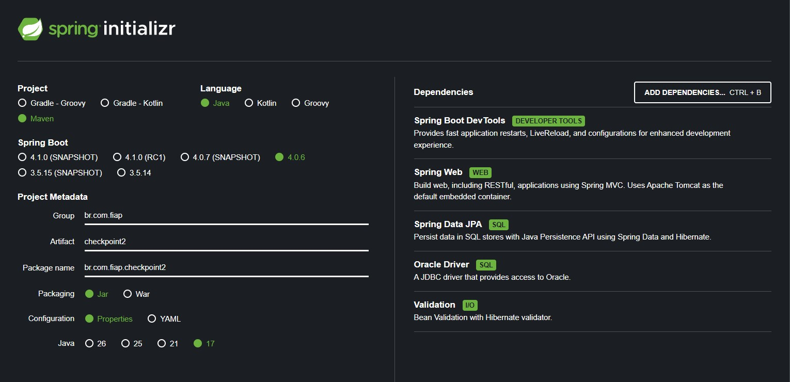

# Checkpoint 2 - API de Brinquedos

Projeto desenvolvido em Java com Spring Boot e Maven para realizar um CRUD de brinquedos com persistência no banco Oracle.

## Integrantes

- Matheus Vecchi - RM561716
- Nicholas Buzo - RM561082

## Tecnologias

- Java 17
- Spring Boot
- Maven
- Spring Web
- Spring Data JPA
- Oracle Driver
- Validation
- Postman
- Oracle SQL Developer

## Descrição

A API permite cadastrar, consultar, atualizar e excluir brinquedos.

Cada brinquedo possui os seguintes campos:

- id
- nome
- tipo
- classificacao
- tamanho
- preco

## Endpoints

Rodando localmente em: 

```
http://localhost:8080
```

| Método HTTP | URL |
|-------------|-----|
| GET | `/brinquedos`
| GET | `/brinquedos/{id}`
| POST | `/brinquedos`
| PUT | `/brinquedos/{id}`
| DELETE | `/brinquedos/{id}`

## Estrutura JSON

### POST/brinquedos
```
{
  "nome": "Bola de futebol",
  "tipo": "Bola",
  "classificacao": "Livre",
  "tamanho": "Médio",
  "preco": 109.99
}
```


## Prints

### GET (listar todos)


### GET (listar por ID)


### PUT


### POST


### DELETE


### SPRING CONFIG

